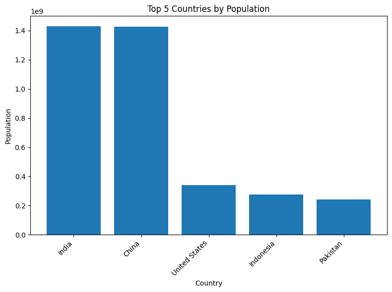

# Country-Population-Web-Scraping

## Table of Contents
- [Project Overview](#project-overview)
- [Data Sources](#data-sources)
- [Tools](#tools)
- [Data Cleaning/Preparation](#data-cleaningpreparation)
- [Web Scraping](#web-scraping)
- [Exploratory Data Analysis](#exploratory-data-analysis)
- [Conclusion](#conclusion)

### Project Overview
---
This project aims to develop a Python script to scrape population data from the web.

### Data Sources
The data source for this project will be from a public population data websites

### Tools
- Python - Web Scraping, Data Analysis, Data Processing, Data Preparation and Data Visualization

### Data Cleaning/Preparation

In the data preparation phase, we performed the following tasks:
1. Data loading and inspection
2. Data cleaning and formatting

```python
df.info()
df.describe()
df.isnull().sum()
```

### Web Scraping
For web scraping we used
- requests: Used to send HTTP requests to the website and retrieve content.
- BeautifulSoup: Used to parse the HTML content of the webpage and extract data.
- pandas (pd): Used for creating DataFrames to store our scraped data.

We followed the process
- Finding the table containing population data using its ID ('example2').
- Focused on the table body (<tbody>) and did iteratation through each row (tr).
- For each row, we created a dictionary (dic) to store the extracted data.
- We extracted the country name from the second table cell (td) and stores it in the dictionary.
- We extracted population data for 2024 from the third table cell, removed commas, converted it to an integer to enable calculations, and stored it in the dictionary.
- Extracted world share data from the twelfth table cell and stored it in the dictionary.

All the extracted data for each country was appended to a list called countries_list

```python
url = 'https://www.worldometers.info/world-population/population-by-country/#google_vignette'
response = requests.get(url)
response = response.content
soup = BeautifulSoup(response, 'html.parser')
rows = soup.find('table', {'id': 'example2'}).find('tbody').find_all('tr')
countries_list = []

for row in rows:
    dic = {}
    dic['Country'] = row.find_all('td')[1].text
    dic['Population 2024'] = int(row.find_all('td')[2].text.replace(',', ''))
    dic['World Share'] = row.find_all('td')[11].text
    countries_list.append(dic)
```

To create a DataFrame to store our data, we used:
```python
df = pd.DataFrame(countries_list)
```

To store our data to our local machine we used:
```python
df.to_csv('Country_Population.csv', index=False)
```

### Exploratory Data Analysis
- We checked the data for null values
```python
df.isnull().sum()
```
Through this we were able to determine that we had no null values in our dataset
- To determine the total number of countries in our data, we used:
```python
df['Country'].nunique()
```
The total number of countries was discovered to be 234

- To determine the Top 5 Counties by Population, we used;
```python
top_populated_countries = pd.DataFrame(df.groupby('Country')['Population 2024'].sum().sort_values(ascending = False).reset_index()).head(5)
top_populated_countries
```
For the visualization, we used;
```python
plt.figure(figsize=(8, 6))  # Adjust figure size as desired
plt.bar(top_populated_countries['Country'], top_populated_countries['Population 2024'])
plt.xlabel('Country')
plt.ylabel('Population')
plt.title('Top 5 Countries by Population')
plt.xticks(rotation=45, ha='right')  # Rotate book titles for better readability

# Display the chart
plt.tight_layout()
plt.show()
```


### Conclusion
This project successfully scraped population data for the year 2024 from the Worldometer website.
It's important to acknowledge that this data is a snapshot from a single source and may not account for real-time population changes. However, it provides a valuable starting point for further analysis or comparison with data from other sources.
